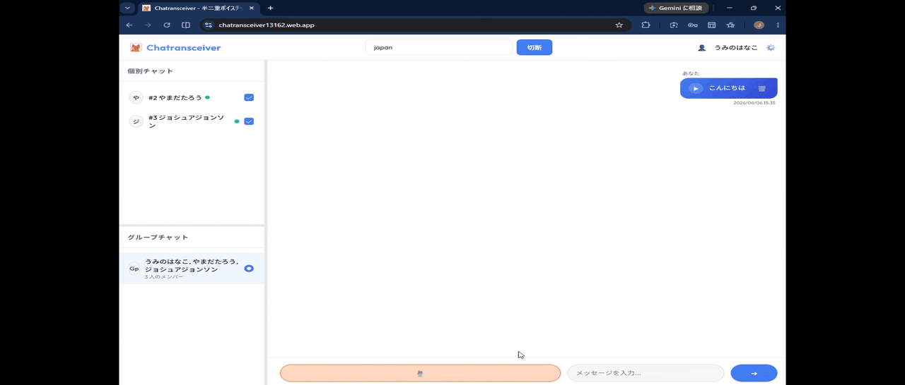

# Chatransceiver

> **15秒トランシーバー！文字起こし付きチャット**



## 📖 概要 (What is this?)

トランシーバーアプリ<br>
Google Chromeで動作<br>
最大15秒の会話<br>
音声は文字おこししてチャットテキスト化<br>
文字入力は音声読み上げ<br>
アプリを閉じても通知（PC,Android）<br>
チャット履歴から何度もリプレイ可<br>
DiscordのWebhookに通知機能あり（上級者向け）<br>

---

## 🚀 使い方 (How to Use)

**1. ログインとコミュニティ参加**
* アプリのURLにアクセスし、「Googleでログイン」ボタンからログインします。<br>※案内される権限は与えてください
* 招待リンクからアクセスするか、コミュニティIDを入力して参加します。

**2. 音声の送信 (PTT)**
* 画面下部にある大きなマイクボタンを**長押し（タップしたまま）**して話し始めます。
* 15秒経過するか、指を離すと音声とテキストがグループ全員に送信されます。

**3. 音声の再生と確認**
* 新着メッセージは自動的に再生されます。
* 再生されなかった過去のメッセージも、チャット画面の再生ボタンを押すことで聞き直すことができます。

---

## 🛠 開発者向け：技術スタック (Tech Stack)

* **Frontend**: HTML / Vanilla CSS / TypeScript (Vite)
* **Backend**: Supabase (Auth, PostgreSQL, Storage, Realtime, Edge Functions)
* **Hosting**: Firebase Hosting

## 💻 開発者向け：ローカル環境の構築手順 (Getting Started)

### 前提条件
* Node.js (v20以上推奨)
* npm または yarn
* Supabase CLI (任意: Edge Functionのローカルテストやデプロイ用)

### セットアップ
1. リポジトリのクローン
   ```bash
   git clone <repository-url>
   cd Chatransceiver
   ```
2. 依存関係のインストール
   ```bash
   npm install
   ```
3. 環境変数の設定
   * リポジトリ直下に `.env` ファイルを作成し、Supabaseの接続情報を記載します（`.env.example` を参照してください）。
4. ローカル開発サーバーの起動
   ```bash
   npm run dev
   ```

### デプロイ
* フロントエンド: `npm run deploy` (Firebase Hosting)
* バックエンド: `supabase functions deploy send-push-notification` (Edge Functions)

---

## 📚 プロジェクトドキュメント (Documentation)

開発に関わる設計や仕様については、`docs/` ディレクトリを参照してください。
* [コンテキスト・プロジェクト概要 (context.md)](./docs/context.md)
* [機能仕様書 (specifications.md)](./docs/specifications.md)
* [データベース設計 (database_design.md)](./docs/database_design.md)
* [意思決定ログ (decisions.md)](./docs/decisions.md)

---

## 🤖 AI Assistant Guidelines (AIへの指示)

このプロジェクトでは、AIアシスタントと共同で仕様を議論しながら開発を進めています。
**セッションがリセットされた際や、新しく開発に参加したAIは、まず以下の手順でコンテキストを復元してください。**

### 1. 復元手順
1. `docs/context.md` を読み込み、プロジェクトの目的と全体像を把握する。
2. `docs/discussion.md` を読み込み、現在議論中のトピックや次に話すべきアジェンダを確認する。
3. `docs/specifications.md` と `docs/decisions.md` を読み込み、これまでに確定した仕様と決定経緯を把握する。
4. 復元が完了したら、ユーザーに「ここまでの文脈を理解しました。現在議論中の〇〇について話を進めましょう」と提案する。

### 2. ドキュメント運用のルール
議論が進む中で、仕様や状況に変化があった場合は、AIが責任を持って以下のファイルを更新してください。
* `docs/context.md`: 全体像や技術スタックの更新
* `docs/specifications.md`: 確定した仕様の追記・整理
* `docs/decisions.md`: 決定した事項とその理由のログ追加
* `docs/discussion.md`: 議論中・未解決事項のアップデート
