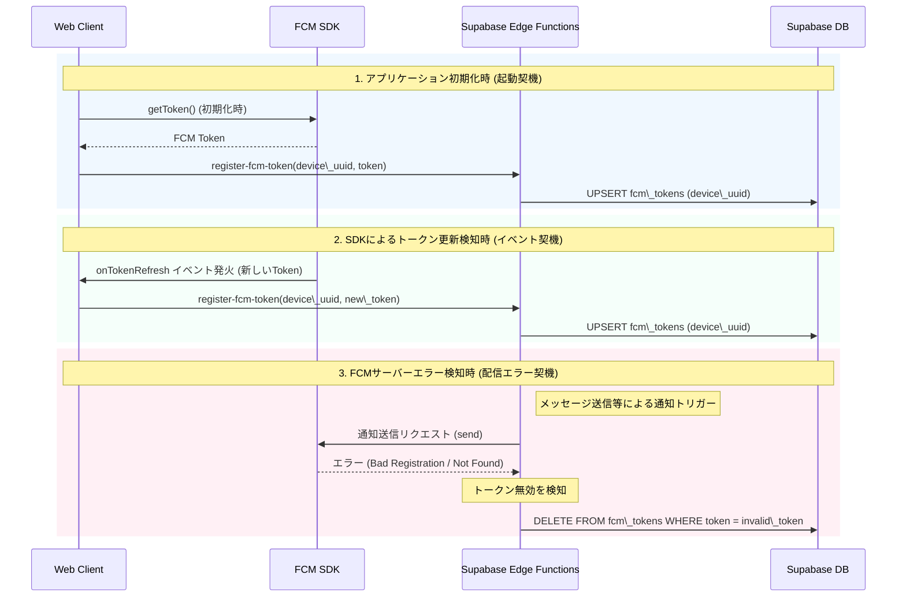

# FCMプッシュ通知機能の実装計画

提供された `fcm\_token\_design\_discussion.pdf` に基づき、複数端末・複数プロファイル環境で安定して動作する、クライアント発行UUID方式によるFCMプッシュ通知機能の実装計画を作成しました。

## User Review Required

> \[!IMPORTANT]
> \*\*Firebase プロジェクトの準備\*\*
> FCMを使用するためには、Firebaseプロジェクトが作成され、ウェブアプリとして登録されている必要があります。また、サーバー側（Edge Functions）からFCM APIを叩くために、Firebaseのサービスアカウントキー（またはFirebase Admin SDKの設定）が必要です。
> 実装に入る前に、Firebaseプロジェクトの用意があるか、または新規作成して良いか確認させてください。

> \[!IMPORTANT]
> \*\*Supabase Edge Functions の利用\*\*
> FCMトークンの登録や、メッセージ送信時のプッシュ通知発火には Supabase Edge Functions を使用します。ローカルでの開発・テストには Supabase CLI が必要になります。現在ローカル環境で Supabase CLI はセットアップ済みでしょうか？

## Open Questions

> \[!WARNING]
> \*\*通知のトリガーと対象について\*\*
> 既存の仕様では、メッセージを受信するとDBトリガーによって `user\_inboxes` にレコードが作成されます。このタイミングでEdge Functionを呼び出し、未読になったユーザーに対してプッシュ通知を送るという設計でよろしいでしょうか？

## トークン更新の3つの契機とシーケンス

ディスカッション資料に基づき、FCMトークンがSupabaseへ登録・更新、または削除される「3つの契機」を以下のシーケンス図で解説します。



### 解説

1. **アプリケーション初期化時 (起動契機)**:
ユーザーがアプリを立ち上げ（またはログインを完了し）、Firebase SDK が初期化されたタイミングで最新のトークンを取得します。これが初回登録、またはアプリを閉じていた間の未検知の変更を反映する役割を果たします。
2. **SDKによるトークン更新検知時 (イベント契機)**:
アプリを起動してアクティブな間に、Google側がセキュリティ上の理由等でバックグラウンドでトークンをローテーションした場合、SDKのイベントリスナー（`onTokenRefresh` 相当）が発火します。これを受けて即座にデータベースを新しいトークンに書き換えます。
3. **FCMサーバーエラー検知時 (配信エラー契機)**:
アプリがアンインストールされたり、ブラウザのデータが消去されるなどしてトークンが無効化された場合、クライアント側からは検知できません。そのため、\*\*「実際に通知を送信しようとして失敗した（FCMから無効エラーが返ってきた）タイミング」\*\*で、バックエンド側から該当の無効なトークンをデータベースから削除し、無駄な送信をクリーンアップします。

## Firebase側の事前準備手順

本機能を実装・動作させるために、事前にFirebaseコンソール上で以下の作業を行う必要があります。

1. **Firebaseプロジェクトの作成とWebアプリの登録**

   * Firebase Console にアクセスし、プロジェクトを作成（または既存のものを選択）します。
   * 「プロジェクトの概要」から「Web アプリ」を追加（`</>` アイコン）します。
   * 登録後に表示される `firebaseConfig` オブジェクト（`apiKey`, `projectId`, `messagingSenderId`, `appId` 等が含まれるもの）を控えておきます。これは後ほどフロントエンドの環境変数（`.env` 等）として設定します。
2. **VAPIDキー（公開鍵）の生成**

   * Firebase Consoleの「プロジェクトの設定」 > 「Cloud Messaging」タブを開きます。
   * 下部の「ウェブ設定」セクションにて、「Web Push 証明書（VAPID キー）」の「Generate key pair（鍵ペアの生成）」をクリックします。
   * 生成された文字列（パブリックキー）を控えておきます。フロントエンドでFCMのトークンを取得する際（`getToken({ vapidKey: '...' })`）に使用します。
3. **サービスアカウントキーの生成 (バックエンド用)**

   * Supabase Edge Functions（バックエンド）からFCMのサーバーAPI（HTTP v1 API）を呼び出してプッシュ通知を送信するため、管理者権限の認証キーが必要です。
   * Firebase Consoleの「プロジェクトの設定」 > 「サービス アカウント」タブを開きます。
   * 「新しい秘密鍵の生成」をクリックし、JSONファイルをダウンロードします。
   * このJSONファイルの内容を、後ほど Supabase の Secret（環境変数）として Edge Functions 側に登録します。

## Proposed Changes

### 1\. データベース・スキーマ設計 (Supabase)

#### \[NEW] `fcm\_tokens` テーブルの作成

FCMトークンを管理するための新しいテーブルを作成し、RLSを設定します。

* `device\_uuid` (UUID, Primary Key): クライアント側で発行した一意のデバイスID
* `user\_id` (UUID, Foreign Key -> users.id): トークンを所有するユーザーID
* `fcm\_token` (Text): FCMのデバイストークン
* `updated\_at` (Timestamptz)

```sql
-- RLSポリシー例:
-- ユーザーは自分の user\_id に紐づくトークンのみ UPSERT 可能
```

### 2\. バックエンド処理 (Supabase Edge Functions)

#### \[NEW] `register-fcm-token` (Edge Function)

* クライアントから `device\_uuid` と `fcm\_token` を受け取り、`fcm\_tokens` テーブルに UPSERT します。

**想定されるコード (Deno / TypeScript)**:

```typescript
import { serve } from "https://deno.land/std@0.168.0/http/server.ts"
import { createClient } from 'https://esm.sh/@supabase/supabase-js@2'

serve(async (req) => {
  if (req.method === 'OPTIONS') return new Response('ok', { headers: corsHeaders })
  const { device\_uuid, fcm\_token } = await req.json()

  // 認証ヘッダーからユーザーを取得
  const authHeader = req.headers.get('Authorization')!
  const supabase = createClient(
    Deno.env.get('SUPABASE\_URL') ?? '',
    Deno.env.get('SUPABASE\_ANON\_KEY') ?? '',
    { global: { headers: { Authorization: authHeader } } }
  )

  const { data: { user } } = await supabase.auth.getUser()
  if (!user) return new Response('Unauthorized', { status: 401 })

  // トークンのUPSERT
  const { error } = await supabase
    .from('fcm\_tokens')
    .upsert({ 
      device\_uuid, 
      user\_id: user.id, 
      fcm\_token,
      updated\_at: new Date().toISOString()
    })

  if (error) return new Response(error.message, { status: 500 })
  return new Response(JSON.stringify({ success: true }), { headers: { 'Content-Type': 'application/json' } })
})
```

#### \[NEW] `send-push-notification` (Edge Function)

* `user\_inboxes` への INSERT をフックする Webhook (Database Webhooks) から呼び出されます。
* 該当ユーザーの `fcm\_tokens` を取得し、Firebase Admin SDK（または HTTP v1 API）を用いてFCMへ通知リクエストを送信します。
* **エラーハンドリング**: FCMから「Bad Registration」や「Not Found」エラーが返ってきた場合、該当の `device\_uuid` のレコードを `fcm\_tokens` テーブルから削除します。

**想定されるコード (Deno / TypeScript)**:

```typescript
import { serve } from "https://deno.land/std@0.168.0/http/server.ts"
import { createClient } from 'https://esm.sh/@supabase/supabase-js@2'

// Service Account は環境変数 (Secret) から取得
const FIREBASE\_SERVICE\_ACCOUNT = JSON.parse(Deno.env.get('FIREBASE\_SERVICE\_ACCOUNT') || '{}')

serve(async (req) => {
  // DB Webhookからのペイロードを受け取る
  const payload = await req.json()
  const record = payload.record // 挿入された user\_inboxes レコード
  
  if (payload.type !== 'INSERT') return new Response('OK')

  // Supabase Admin Client の作成 (DBの読み書き用)
  const supabaseAdmin = createClient(
    Deno.env.get('SUPABASE\_URL') ?? '',
    Deno.env.get('SUPABASE\_SERVICE\_ROLE\_KEY') ?? ''
  )

  // 対象ユーザーの送信先 FCM トークンを全て取得
  const { data: tokens } = await supabaseAdmin
    .from('fcm\_tokens')
    .select('device\_uuid, fcm\_token')
    .eq('user\_id', record.user\_id)

  if (!tokens || tokens.length === 0) return new Response('No tokens')

  // ※ここでメッセージの送信者やテキスト内容を別途DBから引く処理が入ります
  const notificationTitle = "新しいメッセージ"
  const notificationBody = "メッセージが届きました"

  // OAuth2 Token 取得処理 (HTTP v1 API用) 
  const accessToken = await getFirebaseAccessToken(FIREBASE\_SERVICE\_ACCOUNT)

  // 各トークンに対して通知を送信
  const sendPromises = tokens.map(async (t) => {
    const res = await fetch(`https://fcm.googleapis.com/v1/projects/${FIREBASE\_SERVICE\_ACCOUNT.project\_id}/messages:send`, {
      method: 'POST',
      headers: {
        'Authorization': `Bearer ${accessToken}`,
        'Content-Type': 'application/json'
      },
      body: JSON.stringify({
        message: {
          token: t.fcm\_token,
          notification: { title: notificationTitle, body: notificationBody }
        }
      })
    })

    if (!res.ok) {
      const errorData = await res.json()
      const errorCode = errorData.error?.details?.\[0]?.errorCode
      
      // トークンが無効な場合 (UNREGISTERED / INVALID\_ARGUMENT 等)、DBから削除
      if (errorCode === 'UNREGISTERED' || res.status === 404) {
        await supabaseAdmin
          .from('fcm\_tokens')
          .delete()
          .eq('device\_uuid', t.device\_uuid)
      }
    }
  })

  await Promise.all(sendPromises)
  return new Response('Sent')
})

async function getFirebaseAccessToken(serviceAccount: any) {
  // 実際の実装では googleapis パッケージ等を用いてJWTを生成し、アクセストークンを取得します
  return "generated\_access\_token"
}
```

### 3\. フロントエンド実装 (TypeScript / Vite)

#### \[NEW] `src/services/FCMService.ts`

FCMに関する処理をカプセル化するクラス。

* `init()`: 通知の権限要求 (`Notification.requestPermission()`) を行います。
* `getDeviceUUID()`: `localStorage` を確認し、なければUUID (v4) を生成して保存します。
* トークンの取得 (`getToken`) と更新検知 (`onMessage`, `onTokenRefresh` 相当のハンドリング) を行い、バックエンドの `register-fcm-token` 関数を呼び出します。

#### \[NEW] `public/firebase-messaging-sw.js`

* FCMのバックグラウンドメッセージを受け取り、OSのシステム通知を表示するための Service Worker ファイルです。
* **フォアグラウンド（アプリを開いている時）**: アプリが画面に表示されてアクティブな状態では、アプリ内のRealtime機能や自動再生が動作するため、OSレベルのシステム通知は不要となります。FCMの標準動作として、フォアグラウンド時は Service Worker のバックグラウンドハンドラを通らない（またはスクリプト内で状態を判別して無視する）ため、システム通知による二重の通知を防ぎます。
* **バックグラウンド（アプリを閉じている、または端末ロック時）**: ブラウザのタブが背面に回っている、別のアプリを開いている、スマートフォンがスリープ・ロック状態などの場合には、この Service Worker が起動します。ペイロードを受信し `self.registration.showNotification` を呼び出すことで、確実に端末へ通知ポップアップ（ロック画面など）を表示させます。

**想定されるコード (JavaScript)**:

```javascript
importScripts('https://www.gstatic.com/firebasejs/10.7.0/firebase-app-compat.js');
importScripts('https://www.gstatic.com/firebasejs/10.7.0/firebase-messaging-compat.js');

firebase.initializeApp({
  // Firebaseの構成情報
  apiKey: "...", projectId: "...", messagingSenderId: "...", appId: "..."
});

const messaging = firebase.messaging();

messaging.onBackgroundMessage(function(payload) {
  // Edge Functionから 'data' ペイロードとして送信された情報を取得
  const data = payload.data;
  const communityName = data.communityName || 'コミュニティ';
  const senderName = data.senderName || 'ユーザー';
  const messageType = data.messageType || 'text';
  const textContent = data.textContent || '';
  const communityId = data.communityId || '';

  // 通知のタイトルと本文を動的に組み立て
  const notificationTitle = `\[${communityName}] ${senderName}`;
  // 音声の場合も文字起こしされたテキストを表示する
  const notificationBody = messageType === 'audio' 
    ? `🎤 ${textContent}` 
    : textContent;

  const notificationOptions = {
    body: notificationBody,
    icon: '/chatora.png', // アプリのアイコン
    data: { url: `/#community=${communityId}` } // 通知クリック時の遷移先URL
  };

  self.registration.showNotification(notificationTitle, notificationOptions);
});

// 通知クリック時のイベントハンドラ（該当コミュニティのタブを開く・フォーカスする処理）
self.addEventListener('notificationclick', function(event) {
  event.notification.close();
  const urlToOpen = new URL(event.notification.data.url, self.location.origin).href;
  
  event.waitUntil(
    clients.matchAll({ type: 'window', includeUncontrolled: true }).then((windowClients) => {
      // 既に開いているタブがあればフォーカスして該当コミュニティへ遷移
      for (let i = 0; i < windowClients.length; i++) {
        const client = windowClients\[i];
        if (client.url.indexOf(self.location.origin) !== -1 \&\& 'focus' in client) {
          client.navigate(urlToOpen);
          return client.focus();
        }
      }
      // なければ新しく開く
      if (clients.openWindow) {
        return clients.openWindow(urlToOpen);
      }
    })
  );
});
```

#### \[MODIFY] `src/app.ts` (または `App` クラス)

* アプリケーション初期化時（ログイン完了時）に `FCMService.init()` を呼び出すように組み込みます。
* **フォアグラウンドでの別コミュニティ通知の強制発火**: アプリをフォアグラウンドで開いている最中に、FCMから `onMessage` 経由でプッシュ通知ペイロードを受信した場合、その通知が「現在開いているコミュニティ（または表示中の画面）以外」からのものであれば、JavaScriptから強制的にシステム通知（`new Notification(...)`）を呼び出して表示させるロジックを追加します。これにより、別コミュニティ閲覧時でも通知の見落としを防ぎます。

#### \[MODIFY] `package.json`

* 必要なパッケージ（`firebase` 等）を追加します。

## Verification Plan

### Automated / Local Tests

1. Supabase Local を立ち上げ、新しいテーブルとEdge Functionsをデプロイする。
2. フロントエンドを起動し、ログイン時に `localStorage` に `device\_uuid` が保存され、DBの `fcm\_tokens` テーブルにレコードが作成されることを確認する。

### Manual Verification

1. 別のブラウザやシークレットウィンドウで別ユーザーとしてログインする（別デバイス扱い）。
2. メッセージを送信し、バックグラウンドにあるブラウザにFCMプッシュ通知が届くことを確認する。
3. （擬似的に）DB上のFCMトークンを無効な文字列に書き換え、通知を送信させた際に、Edge Functionがエラーを検知してDBから該当レコードを自動削除することを確認する。

