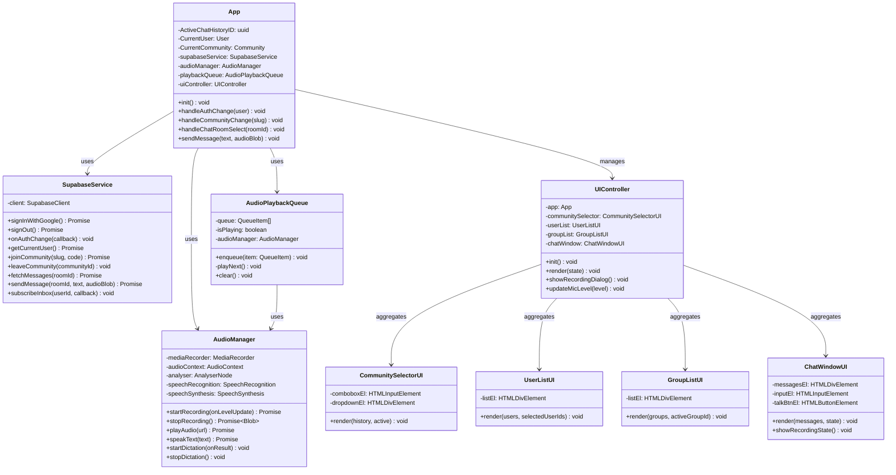

# クラス設計書 (docs/class_design.md)

このファイルは、フロントエンドにおけるクラス分割、各クラスの責務、プロパティ・メソッド、および相互関係（クラス図）を管理します。

## 1. フロントエンド クラス関係図 (Mermaid)

---

## 2. 各クラスの責務と主要メソッド

### 2.1. `App` (アプリケーション・メディエーター)
* **責務**: アプリケーション全体のエントリーポイントであり、状態（State）の一元管理と、各サービス・UIコントローラー間の連携（調整役）を担います。
* **主要ステート**:
  * `CurrentUser`: 現在ログインしているユーザー情報。
  * `CurrentCommunity`: 現在接続しているコミュニティ情報。
  * `ActiveChatHistoryID`: 現在画面に表示しているチャット部屋のID。

### 2.2. `SupabaseService` (データ通信層)
* **責務**: Supabase (Auth, Database, Storage, Realtime) とのすべての通信をカプセル化し、フロントエンドにクリーンなAPIを提供します。
* **主要メソッド**:
  * `subscribeInbox(userId, callback)`: 自分の `user_inboxes` テーブルの新着挿入を常時リッスンし、新着があった場合にコールバックを実行します。

### 2.3. `AudioManager` (音声ハードウェア・API制御)
* **責務**: デバイスのマイク入力（録音、レベルメーター解析）、音声再生、Web Speech API（音声認識・音声合成）のブラウザ標準ハードウェアAPIの制御を一手に引き受けます。
* **主要メソッド**:
  * `speakText(text)`: `window.speechSynthesis` を用いて、日本語テキストを音声合成で読み上げます。
  * `startRecording(onLevelUpdate)`: `MediaRecorder` を開始し、`AnalyserNode` を通じてリアルタイムに音量レベルをコールバックに通知します。

### 2.4. `AudioPlaybackQueue` (グローバル再生キュー)
* **責務**: 届いた音声メッセージやTTSテキストをキューに溜め、順序よく1つずつ連続再生します。音声再生と音声合成の終了イベント（`ended` / `onend`）を抽象化して処理します。

### 2.5. `UIController` および各UIビュークラス
* **責務**: HTML/CSS（DOM）の操作、アニメーション、ユーザーの入力イベント（クリックや打鍵）のハンドリングを担当します。
* 項目ごとにビュー（`CommunitySelectorUI`, `UserListUI`, `GroupListUI`, `ChatWindowUI`）に分割し、`UIController` がこれらを統括します。
* ※DEC-024 のリデザイン後、個別／グループは統合リスト＋フィルタチップに集約されています（実装は `src/ui/` 配下に分割）。

### 2.6. 補助サービス・ユーティリティ（DEC-026/027/029 以降追加）
* **`WakeLockService` (`src/services/wakelock.ts`)**: Screen Wake Lock API による「常時表示」機能 (DEC-026)。ユーザー意思のON/OFF (`enabled`) とセンチネル保持を分離し、`visibilitychange` で画面復帰時にロックを自動再取得します。
* **`MediaButtonPttService` (`src/services/mediabutton.ts`)**: Media Session の play/pause ハンドラでイヤフォン等のメディアボタンPTTを実現 (DEC-027)。メディアキー配送のためのノイズWAV自前生成（ループ再生）と、操作フィードバック用のビープ合成（OscillatorNode）を持ちます。
* **`FCMService` (`src/services/FCMService.ts`)**: Firebase Cloud Messaging のデバイストークン登録・プッシュ通知管理。
* **TTT（ハンズフリー）**: `AudioManager` のウェイクワード待ち受けロジック (DEC-029) と、`App` / `UIController` の状態・UI連携で構成されます。
* **背景画像ストア (`src/utils/db.ts`)**: 背景画像を IndexedDB (`ChatransceiverDB` / `backgroundStore`) に保存・読込・削除するユーティリティ。サーバーには保存しません。
