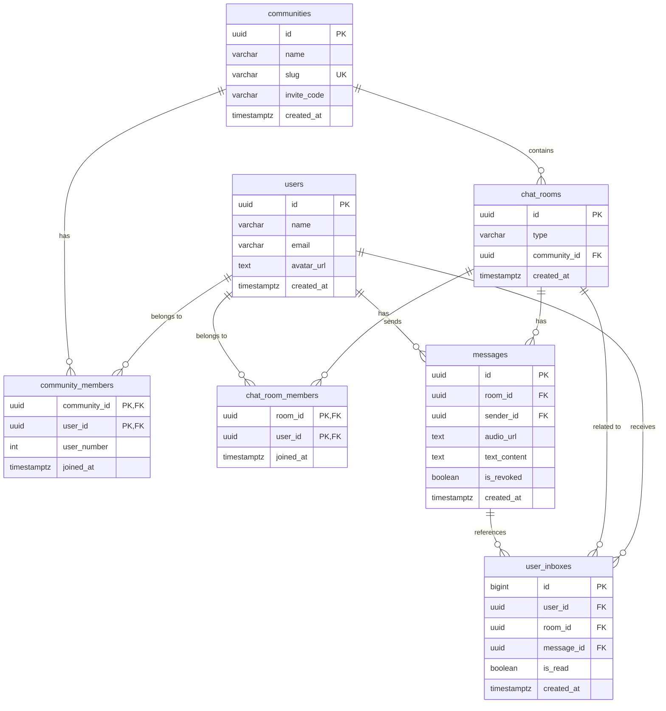

# データベース設計書 (docs/database_design.md)

このファイルは、Supabase (PostgreSQL) におけるテーブルスキーマ、DBML、および Row Level Security (RLS) ポリシーの設計を管理します。

## 1. Mermaid ER図



---

## 2. DBML (Database Markup Language)

```dbml
Table users {
  id uuid [pk, note: 'Supabase auth.users.id と紐づく']
  name varchar [not null, note: 'ニックネーム']
  email varchar [not null]
  avatar_url text
  discord_webhook_url text [note: 'Discord Webhook 通知用URL (プッシュ通知代替)']
  created_at timestamptz [not null, default: `now()`]
}

Table communities {
  id uuid [pk, default: `gen_random_uuid()`]
  name varchar [not null, note: 'コミュニティ名']
  slug varchar [unique, not null, note: 'URL用英数字ID']
  invite_code varchar [not null, note: '招待コード']
  created_at timestamptz [default: `now()`]
}

Table community_members {
  community_id uuid [pk, ref: > communities.id]
  user_id uuid [pk, ref: > users.id]
  user_number int [not null, note: 'コミュ内での参加順連番']
  joined_at timestamptz [default: `now()`]
}

Table chat_rooms {
  id uuid [pk, default: `gen_random_uuid()`]
  type varchar [not null, note: 'individual | group']
  community_id uuid [ref: > communities.id]
  created_at timestamptz [default: `now()`]
}

Table chat_room_members {
  room_id uuid [pk, ref: > chat_rooms.id]
  user_id uuid [pk, ref: > users.id]
  joined_at timestamptz [default: `now()`]
}

Table messages {
  id uuid [pk, default: `gen_random_uuid()`]
  room_id uuid [not null, ref: > chat_rooms.id]
  sender_id uuid [ref: > users.id, note: '退出時はNULL許容（元メンバー扱い）']
  audio_url text [note: '音声ファイルパス。テキストメッセージ時はNULL']
  text_content text [note: 'ディクテーションまたは直接入力のテキスト']
  is_revoked boolean [default: false]
  created_at timestamptz [default: `now()`]
}

Table user_inboxes {
  id bigint [pk, increment]
  user_id uuid [not null, ref: > users.id]
  room_id uuid [not null, ref: > chat_rooms.id]
  message_id uuid [not null, ref: > messages.id, note: 'メッセージが削除されたらカスケード削除']
  is_read boolean [default: false]
  created_at timestamptz [default: `now()`]
}
```

---

## 3. Row Level Security (RLS) およびセキュリティ設計

Supabaseにおける安全なデータアクセスを保証するため、以下のポリシーを定義します。
セキュリティを最大化するため、**「送信者が他のユーザーの `user_inboxes` に直接書き込むのではなく、メッセージのインサートトリガーを利用して自動でファンアウトする」**というセキュアな設計を採用します。

### 3.1. RLS ポリシー定義 (SQL)

```sql
-- すべてのテーブルの RLS を有効化
alter table users enable row level security;
alter table communities enable row level security;
alter table community_members enable row level security;
alter table chat_rooms enable row level security;
alter table chat_room_members enable row level security;
alter table messages enable row level security;
alter table user_inboxes enable row level security;

--------------------------------------------------
-- 1. users テーブル
--------------------------------------------------
-- 全員：ニックネーム等の表示のために他ユーザー情報も参照可能
create policy "Users can read all user profiles"
  on users for select
  using (true);

-- 自分自身：自分のプロフィールのみ更新可能
create policy "Users can update their own profile"
  on users for update
  using (auth.uid() = id);

--------------------------------------------------
-- 2. communities テーブル
--------------------------------------------------
-- 全員：ログイン済みならコミュニティを参照可能
create policy "Authenticated users can view communities"
  on communities for select
  using (auth.role() = 'authenticated');

-- 全員：ログイン済みならコミュニティを作成可能
create policy "Authenticated users can create communities"
  on communities for insert
  with check (auth.role() = 'authenticated');


--------------------------------------------------
-- 3. community_members テーブル
--------------------------------------------------
-- 全員：ログイン済みならコミュニティの所属者一覧を参照可能
create policy "Authenticated users can view community membership"
  on community_members for select
  using (auth.role() = 'authenticated');

-- 自分自身：コミュニティへの参加(INSERT)と退出(DELETE)が可能
create policy "Users can join a community"
  on community_members for insert
  with check (auth.uid() = user_id);

create policy "Users can leave a community"
  on community_members for delete
  using (auth.uid() = user_id);

--------------------------------------------------
-- 4. chat_rooms テーブル
--------------------------------------------------
-- 全員：ログイン済みならチャットルームを参照可能
create policy "Authenticated users can view chat rooms"
  on chat_rooms for select
  using (auth.role() = 'authenticated');

-- 全員：ログイン済みならチャットルーム（グループ）を作成可能
create policy "Authenticated users can create chat rooms"
  on chat_rooms for insert
  with check (auth.role() = 'authenticated');

-- 全員：ログイン済みならチャットルームを削除可能
create policy "Authenticated users can delete chat rooms"
  on chat_rooms for delete
  using (auth.role() = 'authenticated');

--------------------------------------------------
-- 5. chat_room_members テーブル
--------------------------------------------------
-- 全員：ログイン済みなら部屋のメンバー構成を参照可能
create policy "Authenticated users can view room membership"
  on chat_room_members for select
  using (auth.role() = 'authenticated');

-- 全員：ログイン済みなら部屋にメンバーを追加(INSERT)可能
create policy "Authenticated users can add members to rooms"
  on chat_room_members for insert
  with check (auth.role() = 'authenticated');

create policy "Members can leave rooms"
  on chat_room_members for delete
  using (auth.uid() = user_id);

--------------------------------------------------
-- 6. messages テーブル
--------------------------------------------------
-- 全員：ログイン済みならメッセージを参照可能
create policy "Authenticated users can view messages"
  on messages for select
  using (auth.role() = 'authenticated');

-- メンバー：自分自身を送信者としてメッセージを投稿可能
create policy "Users can post messages"
  on messages for insert
  with check (auth.uid() = sender_id);

-- 送信者本人：自分自身のメッセージを取り消し可能
create policy "Users can revoke their own messages"
  on messages for update
  using (auth.uid() = sender_id)
  with check (auth.uid() = sender_id);

-- 全員：ログイン済みならメッセージを削除可能
create policy "Authenticated users can delete messages"
  on messages for delete
  using (auth.role() = 'authenticated');

--------------------------------------------------
-- 7. user_inboxes テーブル
--------------------------------------------------
-- 自分自身：自分の受信箱レコードのみ、参照・既読更新(UPDATE)・クリア(DELETE)が可能
create policy "Users can manage their own inbox"
  on user_inboxes for all
  using (auth.uid() = user_id)
  with check (auth.uid() = user_id);
```

### 3.2. Inbox自動配信（ファンアウト）のためのDBトリガー設計

他人の `user_inboxes` に直接クライアントから `INSERT` させるのは、なりすまし送信や不正アクセスの脆弱性になるため禁止します。
メッセージが送信された際に、PostgreSQL側で**「送信者以外の、同じチャット部屋に参加しているメンバー全員の受信箱へ自動でメッセージを配信する」**トリガーを定義します。

```sql
-- 1. トリガー関数の定義 (SECURITY DEFINER で RLS を越えて相手のInboxへインサートを実行する)
create or replace function public.handle_new_message_fanout()
returns trigger
security definer
language plpgsql
as $$
begin
  -- 送信されたメッセージの部屋(room_id)に属するメンバー(送信者自身を除く)を抽出し、Inboxへ登録する
  insert into public.user_inboxes (user_id, room_id, message_id, is_read)
  select 
    m.user_id, 
    new.room_id, 
    new.id, 
    false
  from public.chat_room_members as m
  where m.room_id = new.room_id
    and m.user_id != new.sender_id; -- 自分自身は自動再生の必要がないため除外

  return new;
end;
$$;

-- 2. メッセージ追加時のトリガーの設定
create trigger on_message_created
  after insert on public.messages
  for each row
  execute function public.handle_new_message_fanout();
```
