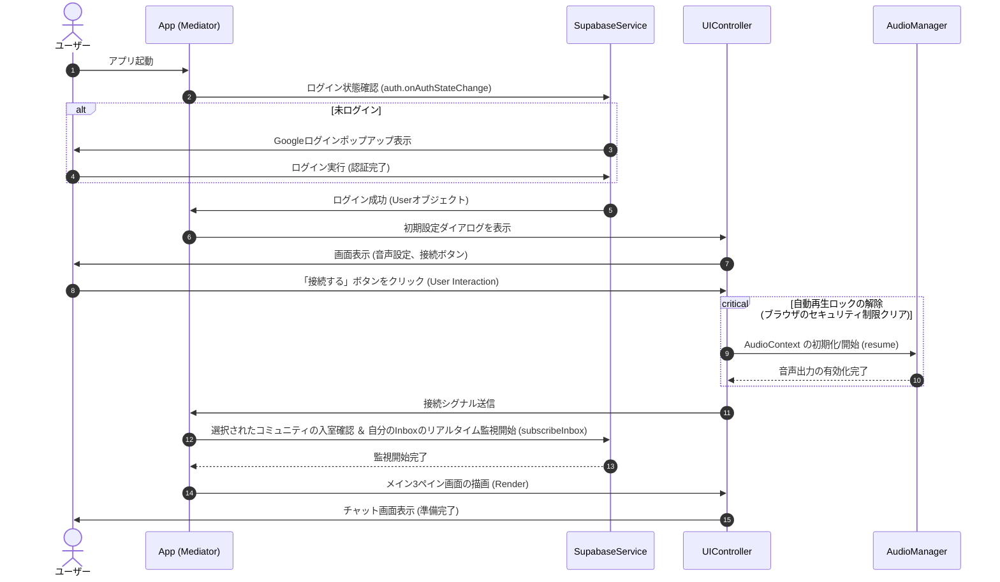
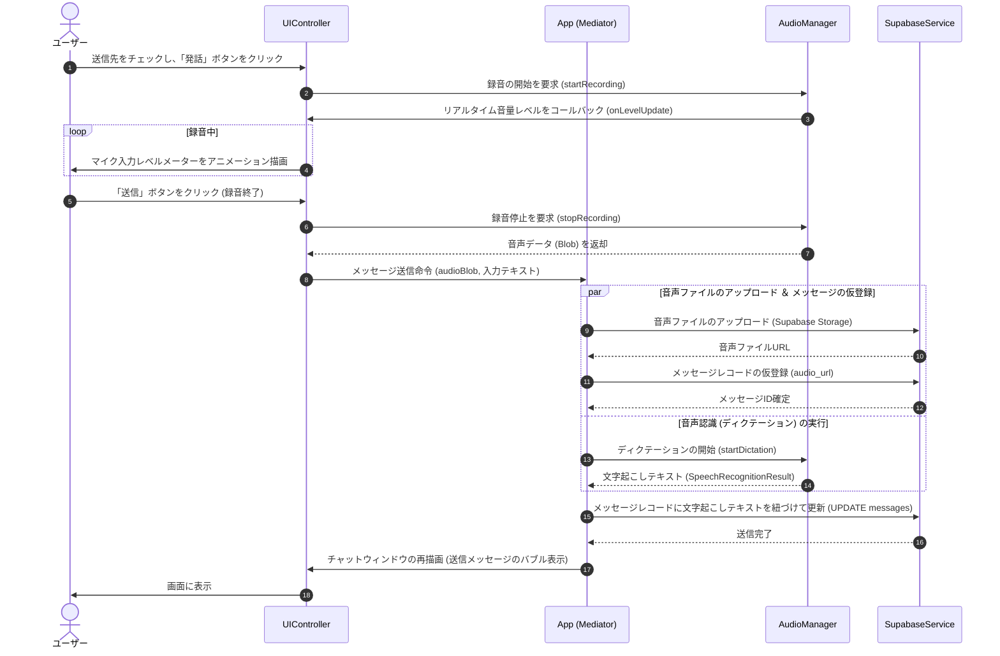
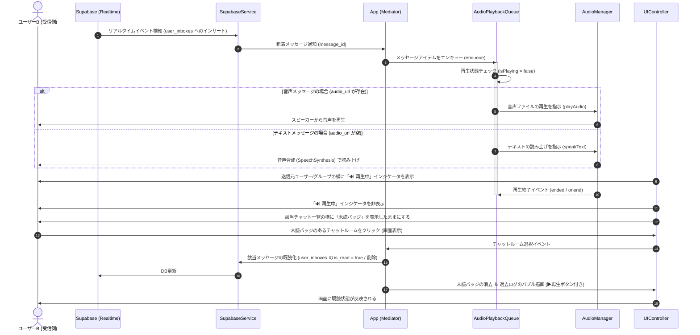
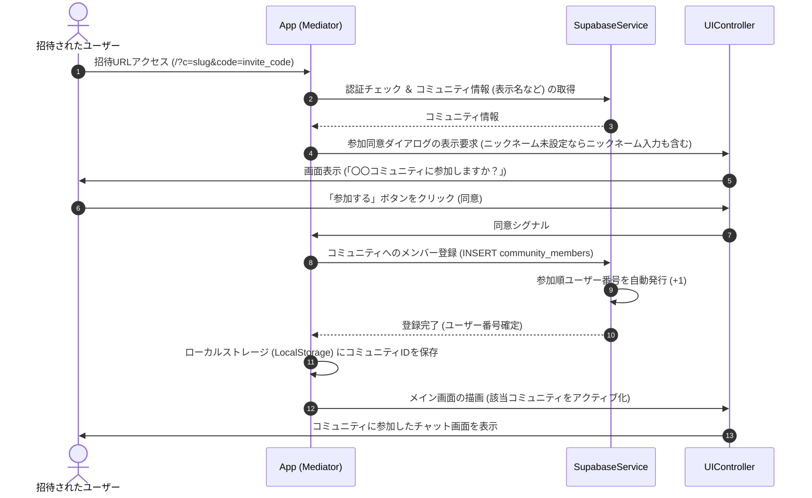

# UML設計書 (docs/uml_diagrams.md)

このファイルは、Mermaidによるフローチャート式のクラス構成図、およびActor（ユーザー）を含めた各主要シナリオのシーケンス図を管理します。

---

## 1. クラス構成・データフロー図 (Mermaid flowchart)

`classDiagram` よりも「データの流れ」と「制御の依存関係」を明確にするため、フローチャート（`flowchart`）形式でクラスの関係を示します。

```mermaid
flowchart TD
    subgraph UI層 (ブラウザDOM)
        Actor[Actor: ユーザー] <--> |操作・視聴| UI[UIController]
        UI --> CommUI[CommunitySelectorUI]
        UI --> UserUI[UserListUI]
        UI --> GroupUI[GroupListUI]
        UI --> ChatUI[ChatWindowUI]
    end

    subgraph コントロール層 (ビジネスロジック)
        UI <--> |イベント通知 / 描画要求| App[App]
        App <--> |録音・再生・音声認識/合成| Audio[AudioManager]
        App <--> |再生スタック管理| Queue[AudioPlaybackQueue]
    end

    subgraph サービス層 (データアクセス)
        App <--> |データCRUD / リアルタイムリッスン| DB[SupabaseService]
    end

    subgraph バックエンド (クラウド)
        DB <--> |SSL / WebSocket| Supabase[(Supabase / Postgres / Storage)]
    end

    Queue --> |順次再生命令| Audio
```

---

## 2. シナリオ別シーケンス図 (Mermaid sequenceDiagram)

### 2.1. 使用開始フロー (ログイン・初期設定〜接続)
ユーザーがアプリを立ち上げ、Googleログインと設定を行ってメイン画面に入るまでの流れです。



---

### 2.2. 発話送信フロー (録音〜文字起こし〜送信)
ユーザーが発話ボタンを押し、録音し、文字起こしを伴ってメッセージを送信するまでの流れです。



---

### 2.3. 受信自動再生フロー (Inbox監視〜順次再生〜既読化)
待機中に新着メッセージを受信し、自動再生（音声/TTS）を行い、画面表示によって既読化されるまでの流れです。



---

### 2.4. 招待リンクからの参加フロー
招待URLからアクセスし、同意ダイアログを経てコミュニティに参加するまでの流れです。


